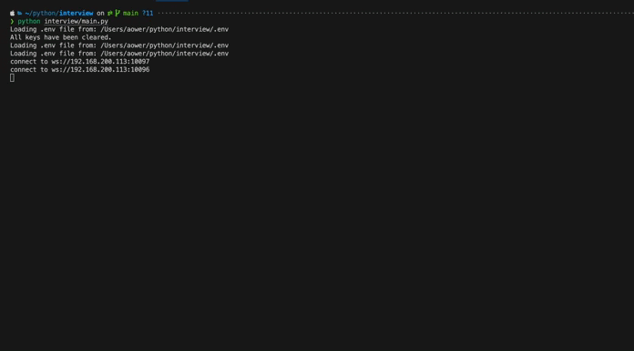
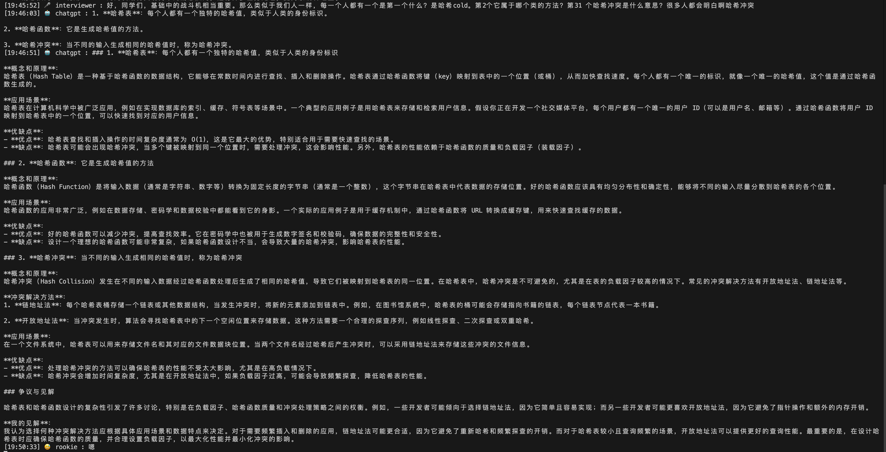

# Simple Interview Audio Processing

> **Disclaimer**: This project is intended solely for technical practice and should not be used for cheating in interviews or any commercial purposes. The author is not responsible for any legal issues arising from the use of this project. If this project causes any inconvenience, please contact the author for removal.

This is a simple, audio-stream-based example project designed to demonstrate basic audio processing capabilities. The inspiration for this project comes from the high-priced paid projects available online. This project aims to show that such functionalities do not require complex technical stacks.



---



## Features

- **Audio Source Processing**: Capture system audio as the `interviewer` source and microphone audio as the `Rookie` source, accurately distinguishing between input and output.
- **Streaming Output**: Supports streaming dialogue output for `interviewer`, `Rookie`, and `ChatGPT`.
- **Custom Settings**: Customize dialogue depth and print content, and control the maximum number of dialogues for `interviewer`, `Rookie`, and `ChatGPT`.
- **Prompt Workflow**: Processes all files in the `prompt` folder according to a preset workflow order.
- **Save Dialogue Records**: Save dialogue records as Markdown files by running `python interview/SaveFile.py`.

## Installation

### 1. Start the Services

Use `docker-compose` to start the services:

```bash
docker-compose up -d
```

#### FunASR Interview Service

Enter the Docker container:

```bash
docker-compose exec funasr_interview bash
```

Inside the Docker container, run the following command to start the service:

```bash
cd FunASR/runtime
nohup bash run_server_2pass.sh \
 --model-dir damo/speech_paraformer-large_asr_nat-zh-cn-16k-common-vocab8404-onnx \
 --online-model-dir damo/speech_paraformer-large_asr_nat-zh-cn-16k-common-vocab8404-online-onnx \
 --vad-dir damo/speech_fsmn_vad_zh-cn-16k-common-onnx \
 --punc-dir damo/punc_ct-transformer_zh-cn-common-vad_realtime-vocab272727-onnx \
 --lm-dir damo/speech_ngram_lm_zh-cn-ai-wesp-fst \
 --itn-dir thuduj12/fst_itn_zh \
 --certfile 0 \
 --hotword ../../hotwords.txt > log.txt 2>&1 &
```

#### FunASR Rookie Service

Enter the Docker container:

```bash
docker-compose exec funasr_rookie bash
```

Inside the Docker container, run the following command to start the service:

```bash
cd FunASR/runtime
nohup bash run_server_2pass.sh \
 --model-dir damo/speech_paraformer-large_asr_nat-zh-cn-16k-common-vocab8404-onnx \
 --online-model-dir damo/speech_paraformer-large_asr_nat-zh-cn-16k-common-vocab8404-online-onnx \
 --vad-dir damo/speech_fsmn_vad_zh-cn-16k-common-onnx \
 --punc-dir damo/punc_ct-transformer_zh-cn-common-vad_realtime-vocab272727-onnx \
 --lm-dir damo/speech_ngram_lm_zh-cn-ai-wesp-fst \
 --itn-dir thuduj12/fst_itn_zh \
 --certfile 0 \
 --hotword ../../hotwords.txt > log.txt 2>&1 &
```

### 2. Install Dependencies

Use Poetry to install dependencies:

```bash
poetry install
```

Enter the virtual environment:

```bash
poetry shell
```

### 3. Configure the `.env` File

Copy the template file and modify it as needed:

```bash
cp .env.template .env
```

Make sure to adjust `AGGREGATE_DEVICE_INDEX`, `MIC_DEVICE_INDEX`, and the GPT `baseurl` and `API` settings.

### 4. Run the Project

Run the main program:

```bash
python interview/main.py
```

## Audio Configuration on macOS and Windows

### Using BlackHole for Audio Capture (macOS)

On macOS, BlackHole is a virtual audio driver that allows seamless audio routing between applications. Here's how to set it up:

1. **Configure an Aggregate Device**:

   - Open the **Audio MIDI Setup** application.
   - Create an Aggregate Device, selecting **BlackHole 2ch** and your Bluetooth headset.
   - Ensure that **BlackHole 2ch** is used as the output device and the Bluetooth headset as the input device.

2. **Configure a Multi-Output Device**:

   - Create a Multi-Output Device, selecting **BlackHole 2ch** and the Bluetooth headset as output devices.
   - Set the Multi-Output Device as the system's default output device.

3. **Run Audio Test**:
   - Use `python interview/audioTest.py` to list all audio input and output devices, and ensure that the sample rate is set to 16K.

### Audio Capture on Windows

On Windows, you can use similar virtual audio devices like **VB-CABLE Virtual Audio Device** or **VoiceMeeter** to achieve functionality similar to BlackHole on macOS. Here's how to use VB-CABLE:

1. **Install VB-CABLE Virtual Audio Device**:

   - Visit the [VB-Audio official website](https://vb-audio.com/Cable/) and download the VB-CABLE installer.
   - Install VB-CABLE Virtual Audio Device, which will then appear as a virtual audio device on your system.

2. **Configure Audio Devices**:

   - Open the **Sound Control Panel** and navigate to the **Playback** and **Recording** tabs.
   - In the **Playback** tab, set `VB-CABLE Input` as the default playback device to capture system audio.
   - In the **Recording** tab, set `VB-CABLE Output` as the default recording device to allow applications to capture system audio input.
   - If you also need to capture microphone audio, set the microphone as an input to `VB-CABLE Output`, or configure advanced settings with VoiceMeeter.

3. **Run Audio Test**:

   - Use `python interview/audioTest.py` to list all audio input and output devices on Windows, ensuring that the selected devices are configured correctly for recording and playback.
   - Ensure the sample rate is set to 16K to be compatible with the ASR model.

With these steps, you can easily set up audio capture on both macOS and Windows for use in your project.

---

Thank you for using this project! If you have any questions or suggestions, please feel free to reach out.
