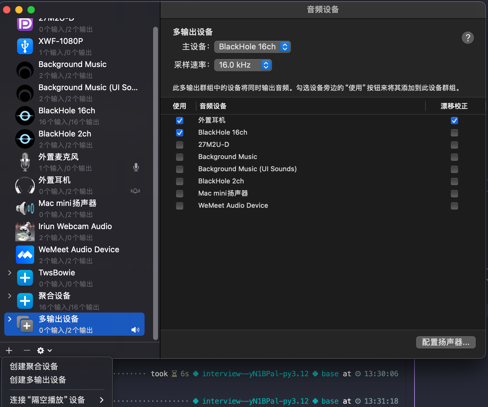
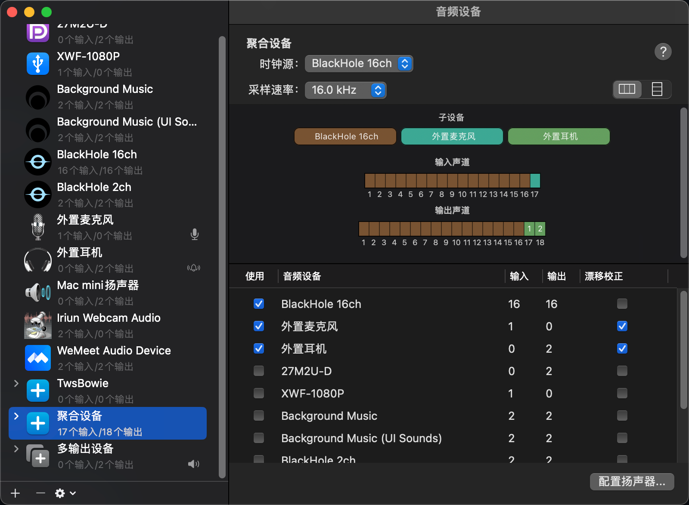
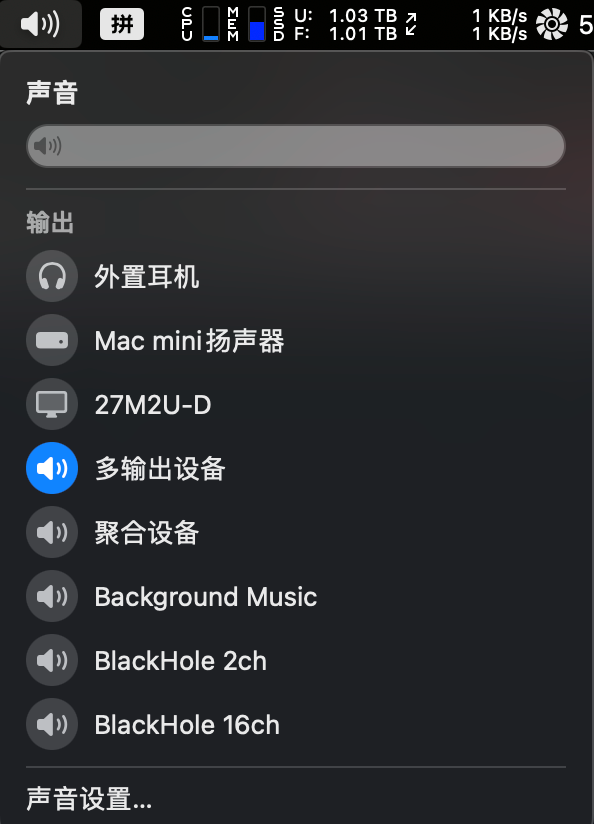

# MacOS User tutorial

在本篇文章中, 将详细介绍在 `MacOS` 系统下如何部署本工具.

本工具主要有两个部分. `截屏询问GPT`, `语音记录询问GPT`. 很高兴的是,这两个模块是互不干扰的, 所以如果你只需要任意一个单独的模块,只需要遵循对应的教程就可以了.

首先，你需要确保本地已经安装了 `Poetry`。如果尚未安装，可以使用以下命令进行安装：

```bash
curl -sSL https://install.python-poetry.org | python3 -
```

添加`Poetry`到系统环境变量中, 可以添加到`.bashrc`或者 `.zshrc` 中长久生效.

安装完成后，确保 `Poetry` 已经添加到你的系统路径中，可以通过以下命令验证安装是否成功：

```bash
poetry --version
```

这将输出 Poetry 的版本信息，确认安装成功。

克隆本项目,并进入项目根目录

```bash
git clone https://github.com/AowerDmax/Simple-Interview-Audio-Processing.git
cd Simple-Interview-Audio-Processing
```

在项目根目录下，运行以下命令来安装项目的所有依赖项：

```bash
poetry install
```

进入虚拟环境

```bash
poetry shell
```

复制`.env` 文件

```
cp env.template .env
```

**注意:**, 你每次进入这个项目都需要`poetry shell`, 然后你就可以使用`python xxx.py` 使用虚拟环境运行`python` 文件了.

启动 `docker` 容器.

```
docker-compose up -d
# 如果你发现后面的步骤出现问题,这里可能会出现问题,使用下面的命令排查
docker-compose down
docker-compose up
查看log日志,看看是哪个服务没有正常启动
docker-compose restart
docker-compose restart <服务名>
```

## 语音记录询问 GPT

这部分的需要的东西有:

1. `openai` ( `deepseek`, `oaipro`, `通义千问` )格式的`api`和`Base_url`
2. 阿里的 `funASR` 进行实时语音识别
3. [BlackHole 16ch](https://github.com/ExistentialAudio/BlackHole)进行语音的分离和采样.

#### BlackHole 16ch 设置

##### 下载安装

Option 1: Install via Homebrew

```
brew install blackhole-16ch
```

Option 2: Download Installer
从链接中安装[BlackHole 16ch](https://existential.audio/blackhole/). 可以选择不捐赠,然后填入自己的邮箱和个人信息,然后在邮箱里面找下载链接.(如果有能力可以捐赠他,**和我没关系**.)

##### 进行 BlackHole 设置

`Command` + `Space` 打开聚焦搜索, 搜索`音频MIDI设置`.
根据下面的截图创建聚合设备和多输出设备, 一定要注意,采样速率和主设备都要保证和下面的图一致. 因为`FunASR`是只支持 `单声道` 和 `16000` 采样率的.







此时,你需要测试一下,你的音响是否能播放声音, 你的麦克风能否正常输入声音.

#### 测试环境

使用 `python interview/audioTest.py` 来获取所有音频输入输出设备.

```
❯ python interview/audioTest.py
Device 0: 27M2U-D
Device 1: XWF-1080P
Device 2: Background Music
Device 3: Background Music (UI Sounds)
Device 4: BlackHole 16ch
Device 5: BlackHole 2ch
Device 6: 外置麦克风
Device 7: 外置耳机
Device 8: Mac mini扬声器
Device 9: Iriun Webcam Audio
Device 10: WeMeet Audio Device
Device 11: TwsBowie
Device 12: 聚合设备
Device 13: 多输出设备
Device 12:
  Name: 聚合设备
  Max Input Channels: 16
  Max Output Channels: 16
  Default Sample Rate: 16000.0
Device 1:
  Name: XWF-1080P
  Max Input Channels: 1
  Max Output Channels: 0
  Default Sample Rate: 48000.0
Recording...
Recording finished and saved to files.
```

我这里选择`Device 1`作为麦克风输入, `Device 12`作为系统内声音输入.

第一次运行一般都会报错的,然后你根据已经列出的所有音频输入设备,选择相应的麦克风输入和系统内声音输入.
运行完这个脚本,在项目的根目录内会生成的`system_audio.wav`,`mic_audio.wav` 里面分别记录了`系统内声音` 和 `麦克风声音`.(注意:此时在读取麦克风输入和系统内声音输入,请保证相应的有输入)
请播放这个文件,来检查自己的设置是否正常.

#### 配置.env 文件

在`.env`文件里面

`AUDIO_FS=16000` 和 `AUDIO_CHANNEL=1` 或者设置成你自己的值

重点修改 `AGGREGATE_DEVICE_INDEX`、`MIC_DEVICE_INDEX` `RAG_ENABLED` 以及 GPT 的 `baseurl` 和 `API` 配置。

可以通过 `MEILISEARCH_DEEP` 来设置 `RAG` 搜索辅助知识的数量

可以通过 `ROOKIE_DIALOG_LEN`, `CHATGPT_DIALOG_LEN`, `INTERVIEWER_DIALOG_LEN` 来分别设置 `终端` 中 各类消息显示的数量. 同时在传入 `GPT` 问答时的对话记录的时候也遵循这个设置.

#### 配置 docker

##### FunASR Interview 服务

进入 Docker 容器内部：

```bash
docker-compose exec funasr_interview bash
```

在 Docker 容器内运行以下命令启动服务：

```bash
cd FunASR/runtime


nohup bash run_server_2pass.sh \
 --model-dir damo/speech_paraformer-large_asr_nat-zh-cn-16k-common-vocab8404-onnx \
 --online-model-dir damo/speech_paraformer-large_asr_nat-zh-cn-16k-common-vocab8404-online-onnx \
 --vad-dir damo/speech_fsmn_vad_zh-cn-16k-common-onnx \
 --punc-dir damo/punc_ct-transformer_zh-cn-common-vad_realtime-vocab272727-onnx \
 --lm-dir damo/speech_ngram_lm_zh-cn-ai-wesp-fst \
 --itn-dir thuduj12/fst_itn_zh \
 --certfile 0 \
 --hotword ../../hotwords.txt > log.txt 2>&1 &
```

##### FunASR Rookie 服务

进入 Docker 容器内部：

```bash
docker-compose exec funasr_rookie bash
```

在 Docker 容器内运行以下命令启动服务：

```bash
cd FunASR/runtime


nohup bash run_server_2pass.sh \
 --model-dir damo/speech_paraformer-large_asr_nat-zh-cn-16k-common-vocab8404-onnx \
 --online-model-dir damo/speech_paraformer-large_asr_nat-zh-cn-16k-common-vocab8404-online-onnx \
 --vad-dir damo/speech_fsmn_vad_zh-cn-16k-common-onnx \
 --punc-dir damo/punc_ct-transformer_zh-cn-common-vad_realtime-vocab272727-onnx \
 --lm-dir damo/speech_ngram_lm_zh-cn-ai-wesp-fst \
 --itn-dir thuduj12/fst_itn_zh \
 --certfile 0 \
 --hotword ../../hotwords.txt > log.txt 2>&1 &
```

#### 运行

```
python interview/main.py
```

使用`Command (⌘) + Option/Alt (⌥) + h` 调用`GPT` 询问.

## 截屏询问 GPT

这部分的需要的东西有:

1. `openai`(或者官转)的`api`和`Base_url`. (这部分没有`deepseek`等其他模型, 需要支持`多模态`)
2. 类似于`CloudFlare`的`R2`的`OSS`. (做图床用,后续可能会支持免费图床) **注意: 一定不能是仅限国内访问的 OSS, 需要美国的 chatGPT 也能访问的到**

[R2 数据库教程(网上搜的)](https://blog.huacai.one/post/3)

在`.env`文件里面

```
# R2 Access Key ID
# This is your R2 account's Access Key ID, used to authenticate API requests.
# R2 Secret Access Key
# This is your R2 account's Secret Access Key, used along with the Access Key ID to authenticate API requests.
# R2 Bucket Name
# The name of the R2 bucket you wish to interact with. This is where your data will be stored.
# R2 Region
# The region where your R2 bucket is located. For example, 'us-west-1'.
# R2 Endpoint URL
# The endpoint URL for accessing the R2 service. This typically includes the protocol and the domain name.
# For example: https://your-endpoint-url.com
# R2 Custom Domain
# If you have a custom domain configured for accessing your R2 bucket, specify it here. 可以和R2 Endpoint URL相同
R2_ACCESS_KEY_ID=your-access-key-id-here
R2_SECRET_ACCESS_KEY=your-secret-access-key-here
R2_BUCKET_NAME=your-bucket-name-here
R2_REGION=your-region-here
R2_ENDPOINT_URL=https://your-endpoint-url-here
R2_CUSTOM_DOMAIN=your-custom-domain-here
```

### 使用

```
python interview/main.py
```

使用`Command (⌘) + Option/Alt (⌥) + a` 调用`algorithm Prompt` 询问.

使用`Command (⌘) + Option/Alt (⌥) + p` 调用`personality Prompt` 询问.

使用`Command (⌘) + Option/Alt (⌥) + g` 调用`general Prompt` 询问.

使用`Command (⌘) + Option/Alt (⌥) + l` 调用`long_screenshot Prompt` 询问. (截屏拼接)

使用`Command (⌘) + Option/Alt (⌥) + f` 调用`fix Prompt` 询问.

使用`Command (⌘) + Option/Alt (⌥) + o` 调用`ocr Prompt` 询问.

## QA

在这里罗列一些可能出现的问题,以及解决方案:

### FunASR

首先这个是`阿里巴巴` 提供的`实时语音转文字`服务. 但是他只支持单声道,16k 采样率. 很多时候我们的电脑是不支持这种设置的, 我`重采样` 了, 所以你应该在你的`.env`中填写正确的内容.
通过`python interview/audioTest.py` 进行测试.

**Q:** 报错.2024-08-17 23:50:04,377 - modelscope - WARNING - Downloading: TLG.fst failed, reason: ('Connection broken: IncompleteRead(1164614 bytes read, 166607546 more expected)', IncompleteRead(1164614 bytes read, 166607546 more expected)) will retry

**A:** 这是因为`modelScope`的下载服务出了问题, 原因可能因为你是国外的网络,导致`modelScope`中的模型下载失败导致的.如果出现了这个问题, 在`docker`的部分
使用下面的命令:

```bash
docker-compose exec <funasr_interview/rookie> bash
```

在 Docker 容器内运行以下命令启动服务：

```bash
cd FunASR/runtime


bash run_server_2pass.sh \
 --model-dir damo/speech_paraformer-large_asr_nat-zh-cn-16k-common-vocab8404-onnx \
 --online-model-dir damo/speech_paraformer-large_asr_nat-zh-cn-16k-common-vocab8404-online-onnx \
 --vad-dir damo/speech_fsmn_vad_zh-cn-16k-common-onnx \
 --punc-dir damo/punc_ct-transformer_zh-cn-common-vad_realtime-vocab272727-onnx \
 --lm-dir damo/speech_ngram_lm_zh-cn-ai-wesp-fst \
 --itn-dir thuduj12/fst_itn_zh \
 --certfile 0 \
 --hotword ../../hotwords.txt
```

查看具体的报错和网络连接失败信息,进行修复.

### websocket

**Q:** websocket 连接失败,或者网页长时间查看不了

**A:** docker 相关的容器和本地机器是不是跨国了, 如果跨国这边会这样,尽量部署在局域网或者国内.
